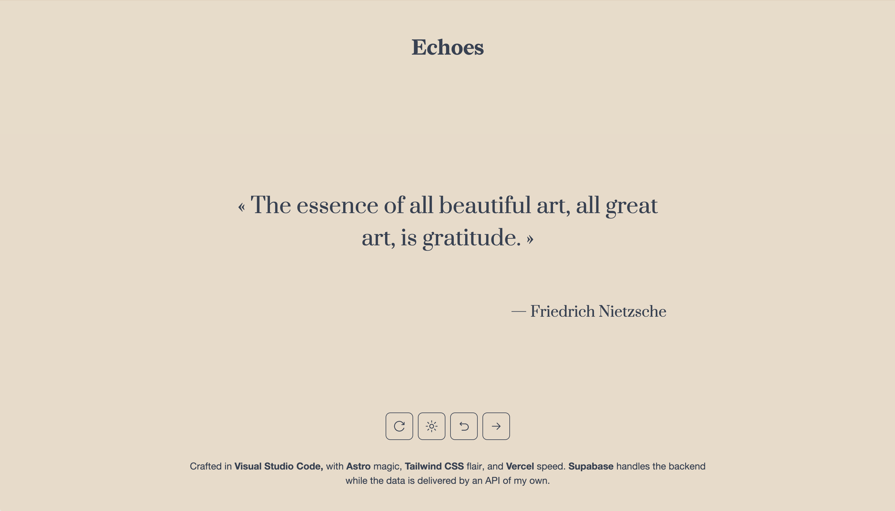

# Echoes

Echoes is a modern web app for discovering and sharing inspiring quotes. Built with Astro, React, TailwindCSS, and Supabase, it features a beautiful, responsive UI with dark mode, smooth animations, and a curated collection of quotes.

## Features

- 🎲 Get a random quote from a curated collection
- 🌙 Dark mode toggle with system preference support
- ✨ Animated transitions and smooth UI
- 📱 Responsive design for all devices
- 🛠️ Powered by Supabase for backend and data

## Screenshots

## Usage

- Click "Get a New Quote" to fetch a random quote.
- Use the dark mode toggle for your preferred theme.
- Navigate through previous/next quotes using the arrow buttons.

## Deployment

You can view the live demo of Echoes here: [mf-echoes.vercel.app](https://mf-echoes.vercel.app/)

> **Note:** If you wish to deploy your own version, you will need access to the private Supabase backend and API used by this project. Without these, the app's core features will not function.

## Credits

- [Astro](https://astro.build/) (with React integration)
- [React](https://react.dev/)
- [TailwindCSS](https://tailwindcss.com/)
- [Supabase](https://supabase.com/)

---

© 2025 Echoes. Built by Mateo Filip.
